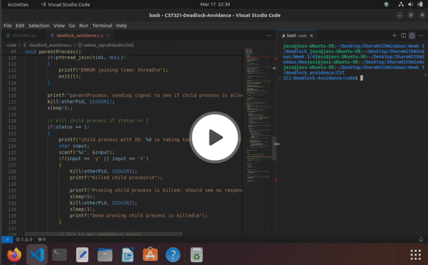

# CST321-Deadlock-Avoidance

The primary focus of the [deadlock_avoidance](./code/deadlock_avoidance.c) program is on simulating a hung child process and detecting and handling it appropriately using signals.

Semaphore Management:
- A semaphore is utilized to control access to a shared resource between the parent and child processes. 
- The semaphore is initialized with a count of 1, ensuring mutual exclusion.

Child Process Behavior:
- The child process demonstrates a simulated hung state by acquiring the semaphore lock and then entering a sleep state for an extended period. 
- This behavior mimics a process that becomes unresponsive or stuck.

Parent Process Monitoring:
- The parent process is responsible for monitoring the child process's state. It attempts to acquire the semaphore within a time frame. If unsuccessful, it initiates a timer thread to check for a hung child process. 
- Upon detection of a hung state, asks the user in the console if they would like to terminate the hung process.  If y, it sends a signal to terminate the child process.

Signal Handling:
- Signal handlers are implemented to facilitate communication between the parent and child processes. Upon receiving specific signals, such as SIGUSR1, the child process terminates gracefully. 
- The parent process utilizes signals to verify the child process's liveness.

Video:

